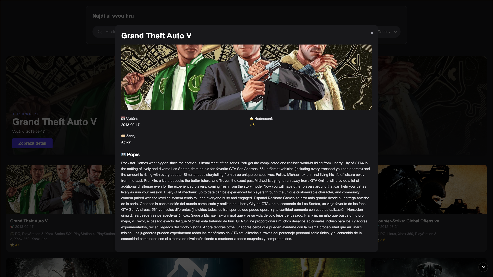

# 🎮 Indie Game Explorer

A modern and stylish web app for discovering indie games using the [RAWG Video Games Database API](https://rawg.io/apidocs).

---

## 📸 Screenshots



---

## 🚀 Features

- 🔍 Search games by name
- 🧩 Filter by platform and release year
- ⭐ Sort by relevance, rating, or release date
- 🎥 Game detail view with trailer, images, and information
- 📱 Fully responsive modern UI
- 🌙 Default dark mode

---

## 🧰 Tech Stack

- **Next.js 15** (App Router)
- **TypeScript**
- **Tailwind CSS**
- **TanStack Query (React Query)**
- **Zod** (data validation)
- **RAWG API**
- **Headless UI** – for modals

---

## 🛠️ Getting Started

1. Install dependencies:

```bash
npm install
```

2. Create a `.env.local` file in the project root:

```env
NEXT_PUBLIC_RAWG_API_KEY=your_rawg_api_key_here
```

> You can get your API key for free at: https://rawg.io/apidocs

3. Run the development server:

```bash
npm run dev
```

Open [http://localhost:3000](http://localhost:3000) in your browser.

---
